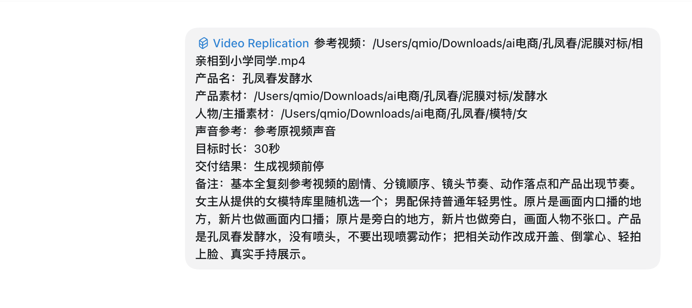

# 视频复刻需求提交规范

请按下面格式提交素材和要求。信息越清楚，视频越容易还原参考片的节奏、镜头和表达。

## 1. 提交方式

### 单条视频

```text
参考视频（本地完整路径）：
产品名：
产品素材（本地完整路径）：
人物/主播素材（本地完整路径）：
声音参考（本地完整路径，或写“参考原视频声音”）：
目标时长：
模型选择：
交付结果：
备注：
```

### 多条视频

一次提交多条视频时，可以把所有任务整理成一个批量清单。

如果希望多条视频同时推进，请明确写：

```text
允许开 subAgent 并行处理本批任务
```

未说明时，默认按一个主任务顺序推进。

```text
参考视频文件夹（本地完整路径）：
产品素材文件夹（本地完整路径）：
人物/主播素材文件夹（本地完整路径）：
声音参考（本地完整路径，或写“参考原视频声音”）：
每条视频目标时长：
模型选择：
每条视频是否共用同一产品：
每条视频是否共用同一人物：
是否允许并行处理：
每条视频的特殊要求：
优先级：
交付结果：
备注：
```

如果不同视频对应不同产品、不同人物或不同声音，请逐条写清楚。

## 2. 填写示例

### 单条视频示例

```text
参考视频：/Users/客户名/Desktop/视频复刻素材/参考视频/相亲相到小学同学.mp4
产品名：孔凤春发酵水
产品素材：/Users/客户名/Desktop/视频复刻素材/产品素材/孔凤春发酵水
人物/主播素材：随机匹配一个年轻女性主播
声音参考：参考原视频声音
目标时长：30秒
模型选择：Seedance 2.0
交付结果：直接要最终视频
备注：基本全复刻。产品没有喷头，不要做喷雾动作；改成开盖、倒掌心、轻拍上脸。
```

### 多条视频示例

```text
参考视频文件夹：/Users/客户名/Desktop/视频复刻素材/参考视频
产品素材文件夹：/Users/客户名/Desktop/视频复刻素材/产品素材
人物/主播素材文件夹：/Users/客户名/Desktop/视频复刻素材/人物素材
声音参考：参考原视频声音
每条视频目标时长：30秒
模型选择：Seedance 2.0
每条视频是否共用同一产品：是
每条视频是否共用同一人物：是
是否允许并行处理：允许开 subAgent 并行处理本批任务
每条视频的特殊要求：按每条参考视频原节奏复刻
优先级：按文件名顺序
交付结果：直接要最终视频
备注：如果某条视频有特殊产品动作，请单独标注。
```

### 真实输入截图示例



## 3. 路径怎么写

参考视频、产品素材、人物/主播素材、声音素材，建议都用完整路径填写。不要只截图文件名，也不要只写“在桌面那个文件夹”。

### Windows 复制路径

在文件资源管理器里选中文件或文件夹，然后用下面任一方式：

- 按 `Ctrl + Shift + C`
- 或按住 `Shift`，右键文件/文件夹，选择“复制为路径”

示例：

```text
C:\Users\客户名\Desktop\视频复刻素材\参考视频\video01.mp4
```

### Mac 复制路径

在 Finder 里选中文件或文件夹，然后按：

```text
Option + Command + C
```

示例：

```text
/Users/客户名/Desktop/视频复刻素材/参考视频/video01.mp4
```

## 4. 必须提供

### 参考视频

提供要复刻的视频文件，或一个包含多条参考视频的文件夹。

建议提供原始清晰版本。如果视频里有口播、旁白、字幕或重要声音，请提供带声音的视频。

### 产品信息

提供最终要替换成的产品名和产品素材。

产品素材建议包括：

- 产品正面图
- 包装细节图
- 标签文字近景
- 使用状态图，例如打开、倒出、涂抹、手持

如果产品没有喷头、刷头、勺子、泵头等结构，但参考视频中有，请提前说明。

### 人物 / 主播素材

可以指定人物，也可以让我们随机匹配。

指定人物时，建议提供：

- 清晰正脸图
- 半身或全身图
- 发型、穿搭、年龄感参考

如果随机匹配，可以写：

```text
随机匹配一个年轻女性主播，真实自然风格
```

多人物视频请说明角色关系，例如“女主用指定人物，男配保持普通男性”。

### 声音参考

选择一种即可：

- 直接参考原视频声音节奏
- 使用客户提供的声音素材
- 不要声音
- 指定声音风格，例如年轻女声、自然口播、普通话

默认会跟随原视频表达方式：原片是画面内口播，新片也做口播；原片是旁白，新片也做旁白。

### 目标时长

请明确目标时长，例如：

- 15 秒
- 30 秒
- 45 秒
- 保持原片时长

如果没有特别说明，默认按竖屏短视频比例制作。

### 模型选择

如果不清楚怎么选，可以不填，默认使用 `Seedance 2.0`。

可选：

- `Seedance 2.0`
- `Seedance 2.0 mini`

模型名按字面精确执行：`Seedance 2.0` 指普通 2.0，不代表 Mini；只有明确填写 `Seedance 2.0 mini` 才使用 Mini。

### 交付结果

选择一种：

- 只要生成前素材包：包含分镜图、音频、提示词和上传素材
- 直接要最终视频
- 先做一段测试

## 5. 建议补充

为了更准确复刻，建议补充这些信息：

```text
必须保留的镜头：
可以简化的镜头：
产品核心卖点：
必须出现的标签或文字：
不能出现的词或画面：
其他特别要求：
```
